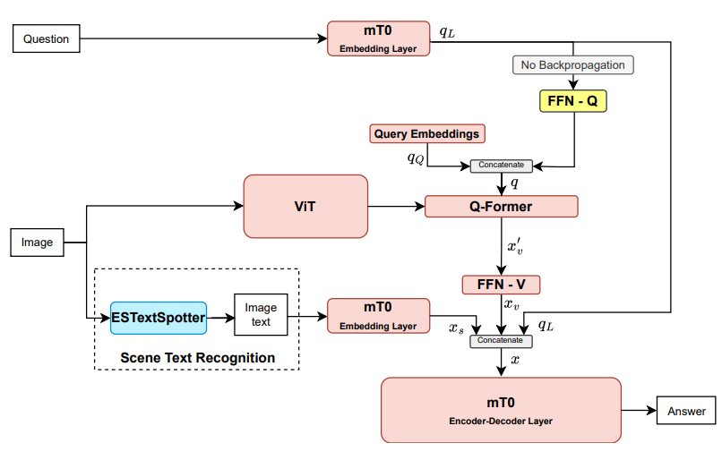
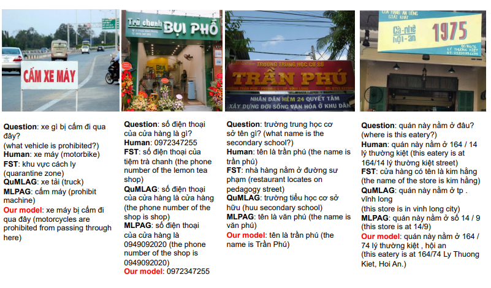

#  Joint Training and Feature Augmentation for Vietnamese Visual Reading Comprehension
In Vietnamese, there is currently limited availability of datasets and methodologies for the Vietnamese Visual Question Answering task. In the VLSP 2023 challenge on Visual Reading Comprehension for Vietnamese, the [OpenViVQA](https://arxiv.org/abs/2305.04183) dataset is employed as the benchmark dataset. This is a challenging dataset with a wide variety of questions, encompassing both the content of the scenery and the text within the images. Notably, all the images are captured in Vietnam, giving this dataset distinct characteristics and cultural features unique to Vietnam. The texts contained within the images are mainly in Vietnamese. Therefore, the VQA system is required to have the capability to recognize and comprehend Vietnamese within the images. The responses are in open-ended format, requiring the VQA system to generate answers. This task is more challenging compared to selecting answers from a predefined list.

To address this challenging task, we propose an approach using three primary models: a Scene Text Recognition model, a Vision model, and a Language model. Particularly, the Scene Text Recognition model is responsible for extracting scene text from image, the Vision model is tasked with extracting visual features from image, and the Language model takes the output from the two aforementioned models as input and generates the corresponding answer for the question. Our approach has achieved a CIDEr score of 3.6384 in the private test set, ranking first among competing teams.

<p align="center">
    <br>
    Diagram of our proposed model
</p>


## Contents
1. [Install](#setup) <br>
2. [Train model](#train_model) <br>
3. [Evaluate model](#evaluate_model) <br>

Our model is available at [letuan/mblip-mt0-xl-vivqa ](https://huggingface.co/letuan/mblip-mt0-xl-vivqa)

## 1. Install <a name="setup"></a>
**Using Docker:**
```bash
sudo docker build -t vivrc_mblip:dev -f Dockerfile .
```

## 2. Train model <a name="train_model"></a>
**Run a docker container:**
```bash
sudo docker run --gpus all --network host \
    --volume ${PWD}/icvrc:/code/icvrc \
    --volume ${PWD}/data:/code/data \
    --volume ${PWD}/models:/code/models \
    --volume ${PWD}/deepspeed_train.sh:/code/deepspeed_train.sh \
    --volume ${PWD}/deepspeed_config.json:/code/deepspeed_config.json \
    -it vivrc_mblip:dev /bin/bash
```

Then, run the code below:
```bash
chmod +x deepspeed_train.sh
./deepspeed_train.sh
```

## 3. Evaluate model <a name="evaluate_model"></a>
**Run a docker container:**
```bash
sudo docker run --gpus all --network host \
    --volume ${PWD}/icvrc:/code/icvrc \
    --volume ${PWD}/data:/code/data \
    --volume <folder containing the model you just downloaded>:/code/models \
    --volume ${PWD}/evaluate.sh:/code/evaluate.sh \
    -it vivrc_mblip:dev /bin/bash
```

Then run the code below to evaluate:
```bash
chmod +x evaluate.sh
./evaluate.sh
```

## 4. Examples

<p align="center">
    <br>
    Generated VQA answers of the proposed model in comparison with that of the baselines.
</p>
